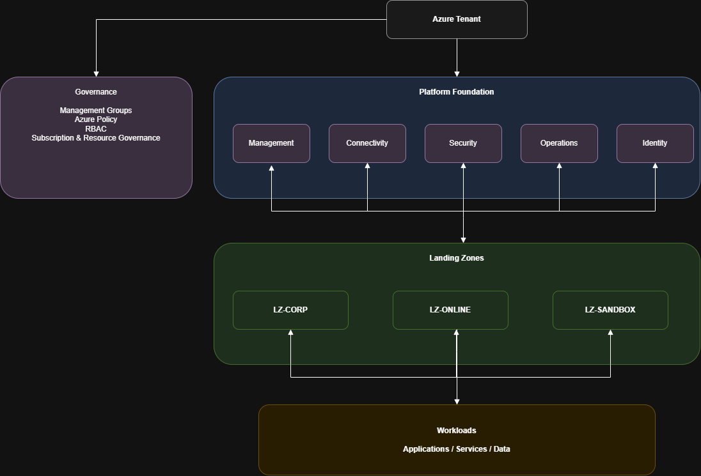

# Azure Enterprise Cloud Foundation


> **Enterprise Azure Cloud Foundation and Landing Zone reference architecture**

A production-inspired Azure enterprise foundation demonstrating how **architecture, governance, security, networking and Infrastructure as Code** can be combined into a reusable platform for enterprise workloads.

The project uses the fictional multinational **Mandara Global** and its **OneCloud 2030** transformation program as the business context.

---

## What this project demonstrates

The project follows an **architecture-first lifecycle**:

```text
Business Requirements
        ↓
Cloud Strategy
        ↓
Architecture Principles
        ↓
Architecture Decisions
        ↓
Reference Architecture
        ↓
Terraform Implementation
        ↓
Azure Foundation
        ↓
Workload Integration
```

The objective is not simply to deploy Azure resources, but to demonstrate how an enterprise cloud foundation can be **designed, governed, implemented and traced from architecture to Infrastructure as Code**.

---

## Architecture



The foundation separates three concerns:

```text
Azure Tenant
     │
     ├── Governance
     │
     └── Platform Foundation
            │
            ├── Management
            ├── Connectivity
            ├── Security
            ├── Operations
            └── Identity
            │
        Landing Zones
        ├── LZ-CORP
        ├── LZ-ONLINE
        └── LZ-SANDBOX
            │
         Workloads
```

**Governance** establishes enterprise-wide controls.
**Platform Foundation** provides shared capabilities.
**Landing Zones** provide controlled workload boundaries.

The architecture deliberately separates **platform responsibilities from workload responsibilities**.

### Architecture views

| View | Purpose |
|---|---|
| **Enterprise Architecture** | Overall foundation and Landing Zone model |
| **Platform & Connectivity** | Platform capabilities, Hub VNet and connectivity patterns |
| **Workload Integration Boundary** | Foundation, Landing Zone and workload responsibilities |

- [Final Architecture](docs/03-architecture/final/01-final-architecture.md)
- [Architecture Diagram Documentation](docs/03-architecture/final/02-final-architecture-diagram.md)
- [Traceability Matrix](docs/03-architecture/final/04-traceability-matrix.md)
- [Architecture source diagrams](docs/03-architecture/final/diagrams/)

---

## What I built

### Enterprise Architecture

- Business and cloud strategy
- Architecture principles
- 10 Architecture Decision Records
- Enterprise reference architectures
- Governance model
- Architecture-to-implementation traceability

### Platform Foundation

Five shared capabilities:

| Capability | Scope |
|---|---|
| **Management** | Platform management and governance |
| **Connectivity** | Hub VNet and enterprise connectivity |
| **Security** | Security controls and key management |
| **Operations** | Monitoring, logging and diagnostics |
| **Identity** | Identity and access foundations |

### Landing Zones

Three workload boundaries:

- **LZ-CORP**
- **LZ-ONLINE**
- **LZ-SANDBOX**

The Landing Zone model provides workload isolation while keeping shared enterprise capabilities centralized.

### Connectivity

The architecture uses a **Hub-and-Spoke** model with private connectivity as the preferred pattern where applicable.

The foundation supports:

- Hub VNet
- Private Endpoints
- Private DNS
- Azure Firewall
- Azure Bastion
- VPN Gateway
- ExpressRoute Gateway

Advanced connectivity services are introduced according to workload or enterprise requirements rather than deployed by default.

---

## Infrastructure as Code

The foundation is implemented with **Terraform** using reusable modules and separate scopes for platform capabilities, Landing Zones and workload infrastructure.

```text
terraform/
├── platform/
├── landingzones/
├── environments/
├── modules/
└── backend/
```

The implementation includes reusable modules for resources such as:

- Virtual Networks and Subnets
- Network Security Groups
- Resource Groups
- Key Vault
- Storage Accounts
- Log Analytics
- Monitoring
- Private Endpoints

Terraform remote state is used to maintain separated deployment scopes.

→ [Terraform documentation](docs/07-terraform/README.md)

---

## Security & Governance

Security and governance are implemented as part of the foundation rather than added at workload level only.

Key controls include:

- Azure Policy
- RBAC
- Managed Identity
- Key Vault
- Required resource governance
- Security and governance baseline
- Centralized diagnostics and logging
- Policy remediation with least-privilege RBAC

The governance model also defines ownership, security exceptions and the boundary between platform and workload responsibilities.

→ [Security documentation](docs/08-security/)

---

## Technology Stack

| Domain | Technologies |
|---|---|
| Cloud | Microsoft Azure |
| IaC | Terraform |
| Identity | Microsoft Entra ID |
| Governance | Management Groups, Azure Policy, RBAC |
| Networking | Hub & Spoke, Private Link, Private DNS |
| Security | Key Vault, Managed Identity, Azure Policy |
| Operations | Azure Monitor, Log Analytics, Managed Grafana |
| DevOps | GitHub, GitHub Actions |
| Architecture | Markdown, Draw.io |

---

## Project Status

### Final Architecture Baseline

Sprint 10 is complete and the project is ready for its first final release: `v1.0.0`.

| Phase | Status |
|---|---|
| Business & Strategy | ✅ |
| Governance | ✅ |
| Architecture Decisions | ✅ |
| Reference Architecture | ✅ |
| Terraform Foundation | ✅ |
| Platform Foundation | ✅ |
| Landing Zones | ✅ |
| Connectivity / Integration | ✅ |
| Security / Governance Hardening | ✅ |
| Final Architecture | ✅ |
| Workload Integration | **Next** |

### Releases

| Version | Milestone |
|---|---|
| `v0.1.0` | Business & Strategy |
| `v0.2.0` | Governance |
| `v0.3.0` | Architecture Decision Records |
| `v0.4.0` | Enterprise Reference Architectures |
| `v0.5.0` | Terraform Foundation |
| `v0.6.0` | Platform Foundation & Governance |
| `v0.7.0` | Landing Zones |
| `v0.8.0` | Connectivity / Integration |
| `v0.9.0` | Security / Governance Hardening |
| `v1.0.0` | Final Architecture — next release |

> `v0.1.0` through `v0.9.0` are the existing project tags. `v1.0.0` will be created and published after the final architecture baseline is committed.

---

## What's next

The foundation is now ready to be consumed by representative workloads.

```text
Azure Enterprise Cloud Foundation
              ↓
        Landing Zones
       ┌──────┼──────┐
       ↓      ↓      ↓
     CORP   ONLINE  SANDBOX
       │      │      │
       └──────┼──────┘
              ↓
          Workloads
```

The next phase focuses on demonstrating how workload projects consume the existing:

- governance
- networking
- security
- identity
- monitoring
- Landing Zone boundaries

without recreating enterprise platform capabilities inside each workload.

---

## Repository Structure

```text
azure-enterprise-cloud-foundation/
│
├── .github/
├── docs/
│   ├── 01-business/       Business Discovery & Requirements
│   ├── 02-strategy/       Cloud Strategy
│   ├── 03-architecture/   Architecture Design
│   ├── 04-governance/     Governance Framework
│   ├── 08-security/       Security Governance & Hardening
│   ├── 09-reference/      Enterprise Reference Architectures
│   └── 10-terraform/      Terraform Documentation
│
├── terraform/             Infrastructure as Code
├── images/                Architecture & documentation assets
│
└── README.md
```

The repository separates **architecture documentation, governance decisions and implementation** so that the relationship between them remains traceable.

---

## About the project

This is a **portfolio architecture project** designed to demonstrate practical skills in:

**Azure Cloud Architecture · Platform Engineering · Landing Zones · Governance · Terraform · Security · System Integration**

It combines enterprise architecture practices with my background in **system integration and architecture of complex automotive systems**.

The implementation is intentionally **production-inspired**, not a claim of production deployment.

---

## Disclaimer

**Mandara Global** and the **OneCloud 2030** transformation program are fictional and created exclusively for educational and portfolio purposes.

The architecture is inspired by Microsoft Azure Cloud Adoption Framework, Azure Landing Zone guidance and enterprise architecture practices. It does not represent any real organization or production environment.
